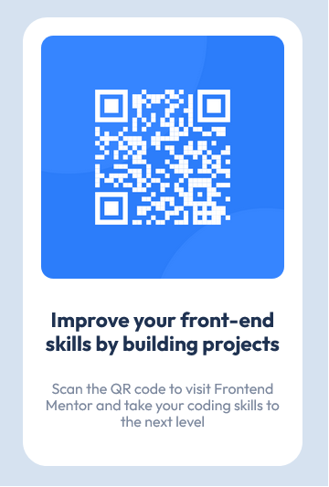

# Frontend Mentor - QR code component solution

This is a solution to the [QR code component challenge on Frontend Mentor](https://www.frontendmentor.io/challenges/qr-code-component-iux_sIO_H). Frontend Mentor challenges help you improve your coding skills by building realistic projects. 

## Table of contents

- [Overview](#overview)
  - [Screenshot](#screenshot)
  - [Links](#links)
- [My process](#my-process)
  - [Built with](#built-with)
  - [Useful resources](#useful-resources)
- [Author](#author)

## Overview

### Screenshot

### Links

- Solution URL: [Github](https://github.com/grantmcdade/fem-qr-code)
- Live Site URL: [Netlify](https://sunny-kringle-b08b07.netlify.app/)

## My process

### Built with

- Semantic HTML5 markup
- CSS custom properties
- CSS Grid
- [UnoCSS](https://github.com/unocss/unocss) - CSS Engine
- [VueJS](https://vuejs.org/) - JS library

### Useful resources

- [Kevin Powell on YouTube](https://www.youtube.com/@KevinPowell) - Provides some very inspirational material

## Author

- Frontend Mentor - [@grantmcdade](https://www.frontendmentor.io/profile/grantmcdade)
- Twitter - [@Rulkosh](https://twitter.com/rulkosh)

[def]: ./Screenshot.jpg
